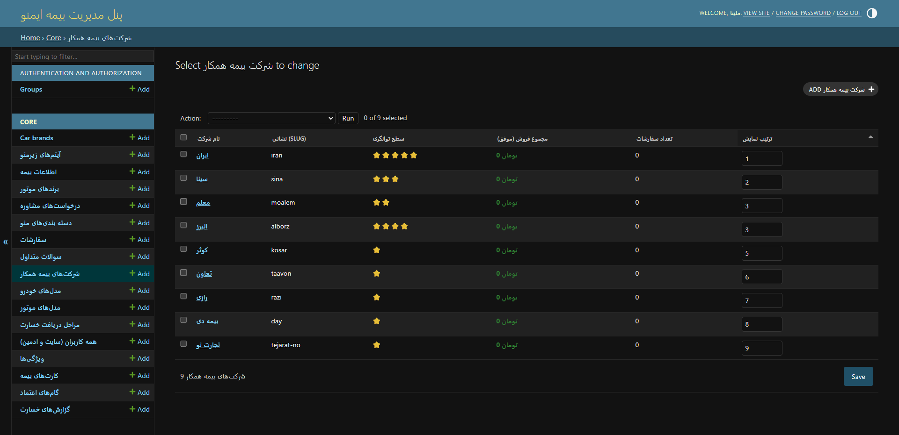

# 🛡 Insurance Pricing & Order Management System

A production-ready Django backend application for insurance comparison, dynamic pricing calculation, and installment-based order management.

This project demonstrates clean architecture, service-layer design, Dockerized deployment, PostgreSQL integration, automated testing, and CI configuration.

---

## 🚀 Features

- 🔎 Compare insurance companies with dynamic pricing
- 💰 Pricing engine based on:
  - Vehicle base value
  - Vehicle production year
  - Company-specific coefficients
- 💳 Cash & installment payment calculation
- 📅 Automatic installment schedule generation
- 👤 Custom user authentication (mobile-based login)
- 📊 User dashboard with order tracking
- 🧪 Unit tests for pricing & installment logic
- 🐳 Dockerized application with PostgreSQL
- 🔁 GitHub Actions CI (automated test execution)

---

## 🏗 Architecture

This project follows Django MTV architecture with a Service Layer pattern.

### Service Layer
- `PricingService` → Handles all pricing calculations
- `OrderService` → Handles installment generation & scheduling

Business logic is completely separated from views to improve maintainability and testability.

---

## 🛠 Tech Stack

- Python 3.11+
- Django
- PostgreSQL
- Docker & Docker Compose
- psycopg
- Git & GitHub Actions

---

## ⚙️ Run Locally (SQLite)

```bash
python -m venv .venv
.venv\Scripts\activate   # Windows
pip install -r requirements.txt
python manage.py migrate
python manage.py runserver
```

---

## 🐳 Run with Docker (PostgreSQL)

### Build & Start

```bash
docker compose up --build
```

### Run Migrations

```bash
docker compose exec web python manage.py migrate
```

### Create Superuser

```bash
docker compose exec web python manage.py createsuperuser
```

Application will be available at:

```
http://localhost:8000
```

---

## 🧪 Run Tests

Locally:

```bash
python manage.py test core -v 2
```

Inside Docker:

```bash
docker compose exec web python manage.py test core -v 2
```

---

## 🔁 Continuous Integration

GitHub Actions automatically runs tests on:

- Every push to `main`
- Every pull request to `main`

Workflow file:

```
.github/workflows/tests.yml
```

---

## 📸 Screenshots

### 🏠 Home & Pricing Pages

<p align="center">
  
  
</p>

---

### 💰 Pricing Results

<p align="center">
  
  
</p>

---

### 🛠 Admin Panel

<p align="center">
  
</p>

---

## 📂 Project Structure

```
core/
 ├── models.py
 ├── views.py
 ├── services/
 │    ├── pricing_service.py
 │    └── order_service.py
 ├── tests.py
imeno/
 ├── settings.py
docker-compose.yml
Dockerfile
.github/
 └── workflows/
     └── tests.yml
screenshots/
 ├── 1.png
 ├── 2.png
 ├── 3.png
 ├── 4.png
 ├── 5.png
```

---

## 🔐 Environment Variables

Create a `.env` file:

```
DEBUG=1
SECRET_KEY=your-secret-key
POSTGRES_DB=imeno
POSTGRES_USER=imeno
POSTGRES_PASSWORD=your-password
POSTGRES_HOST=db
POSTGRES_PORT=5432
```

---

## 📈 What This Project Demonstrates

- Clean separation of concerns
- Service-layer architecture
- Business logic abstraction
- Dockerized deployment
- PostgreSQL production setup
- Environment-based configuration
- Automated testing & CI integration
- REST-style API endpoint design

---

## 📌 Resume Highlights

- Designed and implemented a dynamic insurance pricing engine.
- Refactored business logic into a service layer for improved maintainability.
- Implemented installment scheduling logic with automated due-date generation.
- Dockerized the application with PostgreSQL using Docker Compose.
- Wrote unit tests for pricing and installment functionality.
- Configured GitHub Actions for automated CI test execution.
- Built custom mobile-based authentication system.

---

## 👩‍💻 Author

Fatemeh Nazari  
Backend Developer (Django)

---

## 📄 License

This project is created for educational and portfolio purposes.
