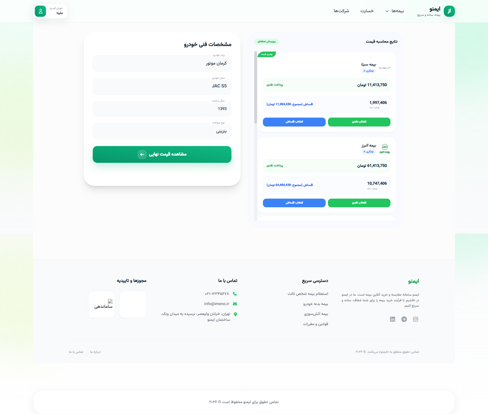
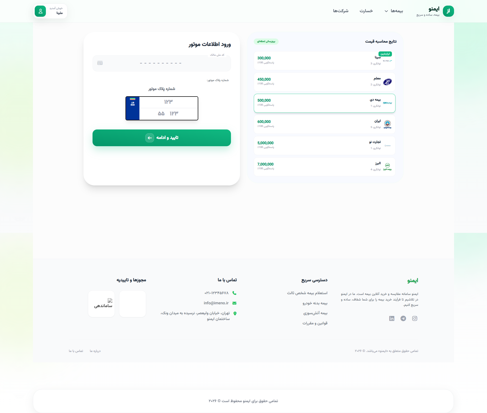
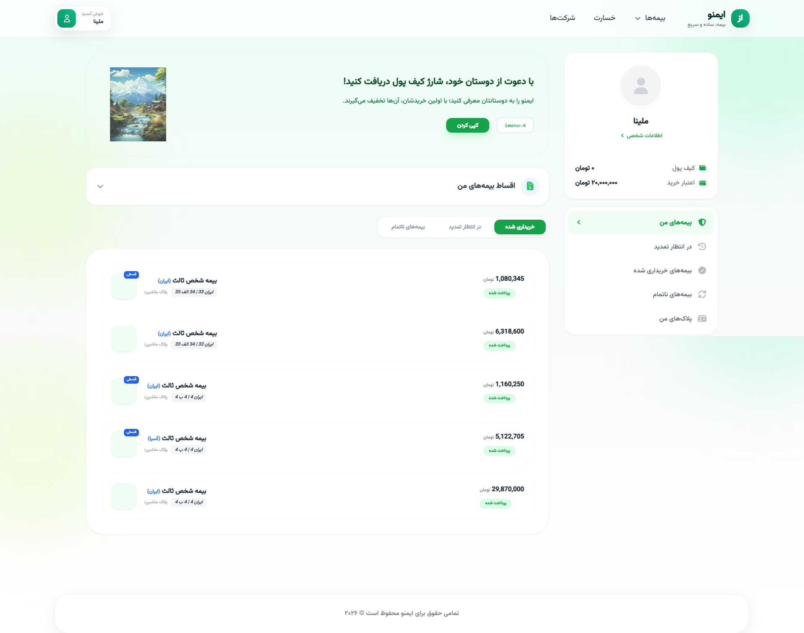

# 🛡 Insurance Pricing & Order Management System

A production-ready Django backend application for insurance comparison, dynamic pricing calculation, and installment-based order management.

This project demonstrates clean architecture, service-layer design, Dockerized deployment, PostgreSQL integration, automated testing, and CI configuration.

---

## 🚀 Features

- 🔎 Compare insurance companies with dynamic pricing
- 💰 Pricing engine based on:
  - Vehicle base value
  - Vehicle production year
  - Company-specific coefficients
- 💳 Cash & installment payment calculation
- 📅 Automatic installment schedule generation
- 👤 Custom user authentication (mobile-based login)
- 📊 User dashboard with order tracking
- 🧪 Unit tests for pricing & installment logic
- 🐳 Dockerized application with PostgreSQL
- 🔁 GitHub Actions CI (automated test execution)

---

## 🏗 Architecture

This project follows Django MTV architecture with a Service Layer pattern:


### Service Layer
- `PricingService` → Handles all pricing calculations
- `OrderService` → Handles installment generation & scheduling

Business logic is completely separated from views to improve maintainability and testability.

---

## 🛠 Tech Stack

- Python 3.11+
- Django
- PostgreSQL
- Docker & Docker Compose
- psycopg
- Git & GitHub Actions

---

## ⚙️ Run Locally (SQLite)

```bash
python -m venv .venv
.venv\Scripts\activate   # Windows
pip install -r requirements.txt
python manage.py migrate
python manage.py runserver


---

## 📸 Screenshots

### 🏠 Home Page


---

### 💰 Pricing Calculation



---

### 👤 User Dashboard


---

### 🛠 Admin Panel

